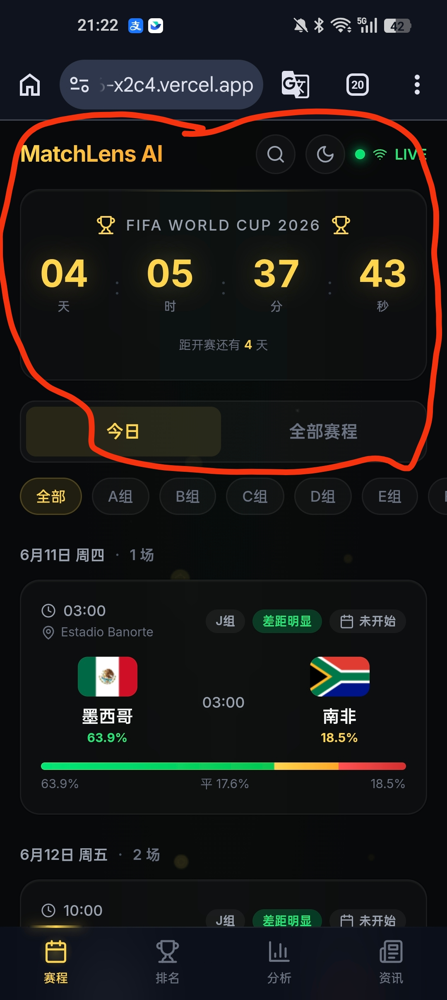
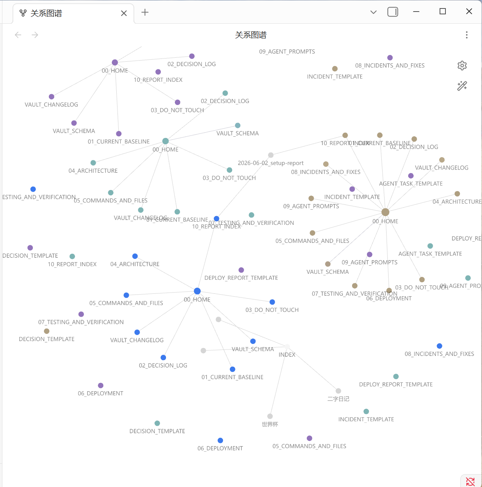

# 🏛️ Project Vault

> 给你的项目建一个「知识保险箱」，AI 开工前读一遍，就不会乱搞。

[English](README.md) | [中文](#快速开始)

## 一句话说明

每次换 AI、换模型、换平台，都要重新解释项目？**不用了。** 存进 `docs/vault/`，AI 读一遍就全懂。

## 快速开始

```bash
# 1. 下载
git clone https://github.com/guqiuwang/project-vault.git /tmp/project-vault

# 2. 在你的项目里跑一行命令（自动检测技术栈、资源、设计稿）
bash /tmp/project-vault/templates/init-vault.sh /你的项目 "项目名"

# 3. 告诉你的 AI
# "先读 docs/vault/00_HOME.md，再开始工作。"
```

完事。

## 你会得到什么

```
你的项目/
├── docs/vault/
│   ├── 00_HOME.md           ← AI 入口（项目是什么、不能碰什么）
│   ├── 01_CURRENT_BASELINE.md ← 当前状态
│   ├── 03_DO_NOT_TOUCH.md   ← 危险区
│   └── ... (共 13 个文件)
└── assets/intake/reports/   ← 报告
```

ChatGPT、Claude、Cursor、Copilot、豆包、Kimi……任何 AI 都行。

## 真实案例

[MatchLens AI](https://github.com/guqiuwang/worldcup-2026) — 2026 世界杯信息站 SPA，全程用 Project Vault 管理。



## 新功能 (v5.5.0)

### Karpathy 编码四原则

来自 [Andrej Karpathy](https://x.com/karpathy/status/2015883857489522876) 对 LLM 编码问题的观察，已集成到每个 agent prompt：

| 原则 | 规则 |
|------|------|
| **先想再写** | 别猜，说清假设，不确定就问 |
| **简单优先** | 最少代码解决问题，200行能50行就50行 |
| **精准修改** | 只改该改的，每行改动都能追溯到需求 |
| **目标驱动** | 先定验收标准，循环到验证通过 |

### Vault 同步纪律

Agent **边做边更新** vault，不是做完再补。每次代码变更立即同步对应的 vault 文件。"等会儿再更新" = 永远不会更新。

## 4 个脚本

| 脚本 | 干什么 | 什么时候用 |
|------|--------|----------|
| `init-vault.sh` | 创建 vault | 新项目开局 |
| `sync-vault.sh` | 同步变更 | 代码改了之后 |
| `audit-vault.sh` | 健康检查 | 每月 / 交接前 |
| `setup-obsidian-link.sh` | 连接 Obsidian | 想看知识图谱 |

## 连接 Obsidian（可选）

```bash
bash /tmp/project-vault/templates/setup-obsidian-link.sh /你的项目/docs/vault "项目名"
```

打开 Obsidian → 左侧看到项目 → `Ctrl+G` 看知识图谱。多个项目各有不同颜色。



## 许可证

MIT
